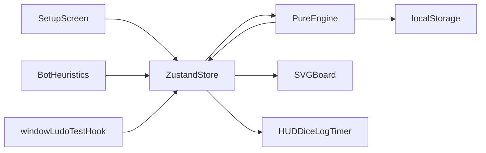

# Web Ludo — Classic / X-Minute / Quick

## Architecture principle

Everything that decides game outcomes lives in a **pure, framework-free, deterministic engine** (`src/engine/`). React only renders engine state and dispatches actions. This is what makes the game testable, the bot cheap to write, and animation bugs incapable of corrupting rules.



## Stack (latest stable, verified today)

- Vite 8.2, React 19.2, TypeScript 7.0, Tailwind CSS 4.3 (via `@tailwindcss/vite`), Zustand 5.0, Motion 13.1 (`motion/react`, the current Framer Motion package)
- Vitest 4.1 + `@vitest/coverage-v8` + `@testing-library/react` 16.3 + `happy-dom`
- `fast-check` 4.9 for property-based fuzzing of the engine
- `@playwright/test` 1.62 (headless Chromium) for E2E, touch emulation and visual snapshots
- `vite-plugin-pwa` 1.3, ESLint 10 + `typescript-eslint` 8, Prettier 3
- Node 26 / npm 11 already present

---

## 1. Board geometry — the exact spec (`src/engine/board.ts`)

This is where most Ludo implementations break, so it is fully pinned down and self-verifying.

**Grid:** 15x15, `row` 0-14 top to bottom, `col` 0-14 left to right. Center home is rows 6-8, cols 6-8.

**Ring:** 52 cells, index 0-51 clockwise. Built from one 13-cell arm rotated 90 degrees three times about the center. Rotation: `rot(r,c) = (c, 14 - r)`.

Arm 0 (ring indices 0-12), in order:
`(6,1) (6,2) (6,3) (6,4) (6,5) (5,6) (4,6) (3,6) (2,6) (1,6) (0,6) (0,7) (0,8)`

Ring indices 13-25 = `rot(arm0)`, 26-38 = `rot²(arm0)`, 39-51 = `rot³(arm0)`.

**Seats** (clockwise, `entryIndex` = ring index of the start square):
- Seat 0 Red — yard rows 0-5 / cols 0-5, start `(6,1)`, entry 0, home column row 7 cols 1→5
- Seat 1 Green — yard rows 0-5 / cols 9-14, start `(1,8)`, entry 13, home column col 7 rows 1→5
- Seat 2 Yellow — yard rows 9-14 / cols 9-14, start `(8,13)`, entry 26, home column row 7 cols 13→9
- Seat 3 Blue — yard rows 9-14 / cols 0-5, start `(13,6)`, entry 39, home column col 7 rows 13→9

**Progress model** — one integer per pawn, `progress ∈ [-1, 56]`:
- `-1` = in yard
- `0..50` = on the ring; `ringIndex = (entryIndex + progress) % 52` (51 ring cells travelled)
- `51..55` = the 5 colored home-column cells
- `56` = HOME (center triangle). Requires an **exact** roll.

**Safe squares:** ring indices `0, 8, 13, 21, 26, 34, 39, 47` (the 4 start squares + 4 stars) plus every home-column cell.

**Seats used for smaller games:** 2 players → seats 0 and 2 (opposite); 3 players → seats 0, 1, 2.

**Mandatory geometry unit tests** (these make the table self-correcting):
- All 52 ring cells are unique, and consecutive cells (including 51→0) are orthogonally adjacent (Manhattan distance 1).
- For every seat, `ring[(entry + 50) % 52]` is orthogonally adjacent to that seat's first home-column cell.
- Every seat's start cell equals `ring[entryIndex]`; ring and home-column cells never overlap; no cell falls inside a yard block.

---

## 2. Canonical rules spec (`docs/RULES.md` — written first, it is the test oracle)

### Shared rules (all modes)
- 4 pawns per player, one six-sided die.
- A pawn leaves the yard onto its start square (progress 0) on a roll of **1 or 6**.
- **Extra roll** is granted when the player: rolls a 6, unlocks a pawn (with either 1 or 6), captures an opponent pawn, or lands a pawn on HOME.
- **Three consecutive 6s**: the turn is forfeited and the whole turn is rolled back to the snapshot taken at turn start (captures and moves from the first two 6s are undone). Clock, event log, RNG cursor and lifetime stats are excluded from the rollback.
- If the rolled value produces **no legal move**, the turn ends immediately with no extra roll (the consecutive-six counter still increments).
- **Capture:** landing on a non-safe ring cell captures every opponent color-group on that cell that contains **exactly one** pawn; captured pawns return to their yard (progress -1). A group of **2 or more same-color pawns is immune**.
- **Stacking:** unlimited pawns of any colors may share a cell. A stack is only immune to capture — opponents may freely **pass over** and **land on** it.
- No captures on safe squares or anywhere in a home column. Only the owning color may enter a home column.

### Mode 1 — Classic
- Shared rules only. A player wins when all 4 pawns reach HOME.
- After the winner is decided, play **continues** among the rest for 2nd/3rd/4th; finished players are skipped and a persistent "Winner" banner is shown. Game ends when only one player remains unfinished.

### Mode 2 — X-Minute (timer)
- X is chosen at setup (presets 1/2/3/5/10 min + custom 1-30).
- All 4 pawns **start on their start square** (progress 0, fanned out visually) — no unlock needed at kickoff.
- A pawn captured mid-game returns to the **yard** and needs a 1 or 6 to re-enter (per your choice).
- **Scoring:** +1 per step moved (ring **and** home column steps count); +30 for each capture; the victim loses points equal to the captured pawn's `progress` at capture time; +50 when a pawn reaches HOME. **Score floors at 0.**
- Entering the board from the yard is 0 steps, so it scores 0.
- When all 4 of a player's pawns are HOME they **all respawn into the yard** and must re-enter with a 1 or 6, so scoring continues to the buzzer.
- Per-turn countdown, default 20s: on expiry the engine auto-rolls and plays a random legal move.
- **Hard stop** at 00:00 — no new roll or move may begin; a move already committed resolves atomically, then the game ends.
- Ranking by score; tie-breaks in order: captures made, total distance travelled, then seat order.

### Mode 3 — Quick
- Shared rules apply (including 1-or-6 unlock).
- A player's home-column entrance is **locked until that player has captured at least one opponent pawn** (tracked **per player** — one capture frees all four of their pawns).
- While locked, a pawn that would pass progress 50 wraps to a new lap: `progress -= 51`, `laps += 1`. Ring position stays `(entry + progress) % 52`.
- **The first pawn of any player to reach HOME ends the game immediately** and that player wins. Others are ranked by `laps * 51 + progress` summed across pawns, tie-broken by captures.
- The UI shows a lock/chain overlay on the home entrance and a "Cut needed" badge until the player's first capture.

---

## 3. Engine design (`src/engine/`)

```
engine/
  types.ts        GameState, Player, Pawn, Move, GameAction, GameMode, GameConfig
  rng.ts          mulberry32 seeded PRNG; state carries {seed, cursor} so games replay exactly
  board.ts        geometry above + isSafe(), ringIndexOf(), cellOf()
  rules.ts        legalMoves(state) -> Move[]; applyMove(state, move) -> state
  turn.ts         rollDice, consecutive-six rollback, extra-roll resolution, turn advance
  scoring.ts      timed-mode point deltas (pure, unit-tested in isolation)
  modes/{classic,timed,quick}.ts   mode hooks: initialPawns, canEnterHome, onCapture,
                                   onPawnHome, winCondition, ranking
  engine.ts       createGame(config) + reduce(state, action) -> state   [the only entry point]
  selectors.ts    derived UI data (never mutates)
```

Rules to enforce in code review: no `Date.now()`, no `Math.random()`, no imports from `react` or `src/components` anywhere under `engine/`. Time enters only as an explicit `nowMs` field on the `TICK` action. Add an ESLint `no-restricted-imports` rule to guarantee this.

Actions: `ROLL`, `SELECT_PAWN`, `MOVE {pawnId}`, `PASS`, `TICK {nowMs}`, `AUTOPLAY`.

---

## 4. Bot (`src/bot/`)

One solid heuristic bot. `chooseMove(state): Move` scores each legal move and takes the max (ties broken by the seeded RNG so bot games replay deterministically):

- Capture, weighted by the victim's progress; huge bonus in Quick mode while the home entrance is still locked
- Land exactly on HOME; enter the home column
- Unlock a pawn when the yard is occupied and the board presence is thin
- Land on a safe square, or form a 2-stack
- Escape a pawn currently within 1-6 squares ahead of an enemy pawn
- Penalty for finishing within 1-6 squares ahead of enemy pawns, scaled by how many threaten it
- Small bonus for advancing the lead pawn; in X-Minute mode, weight the raw immediate point gain (steps + 30 + 50) highest

`botDelayMs` (default 650, set to 0 by the test hook) drives the "thinking" pause.

---

## 5. UI

**Screens:** Setup → Game → Results, with a settings drawer.

**Setup screen:** three large mode cards with animated illustrations; total-player stepper (2-4); humans stepper (1..total, bots auto-filled and displayed); per-seat name/color/avatar; X-minute duration slider; turn-timer toggle; Start button disabled with an inline reason unless total >= 2 and humans >= 1.

**Board:** a single `<svg viewBox="0 0 15 15">` for the static board (yards, ring cells, stars, colored home columns, center triangles) with pawns as absolutely positioned DOM elements over it, animated with `motion/react`. Every cell and pawn carries a `data-testid` (`cell-r6-c1`, `pawn-red-2`) plus `data-progress` / `data-ring-index`, which is what Playwright asserts against.

**Premium feel:** dark glassmorphic shell with per-seat gradient accents, soft inner shadows on cells, subtle grain overlay, spring-animated 3D CSS dice cube, pawns that hop cell-by-cell along their real path (waypoint keyframes, not straight-line tweens), capture "knock-out" arc back to the yard, confetti + glow on reaching home, a rotating glow ring on the active player card.

**Touch and mouse:** `touch-action: manipulation` to kill double-tap zoom, minimum 44px invisible hit circles on pawns, tap-to-move with a highlighted destination preview, long-press to preview a move path, no drag required, safe-area insets, hover affordances only under `@media (hover: hover)`. Layout is driven by `min(100dvw, 100dvh - hudHeight)` so the board is always square and fully visible in both orientations.

**Also in scope:** SFX + music with a mute toggle, dark/light theme, live move-history log panel, post-game stats screen (captures, sixes, distance, points timeline), localStorage autosave/resume, installable PWA.

**Accessibility:** `aria-live` turn announcements, full keyboard play (arrow keys cycle movable pawns, Enter rolls/moves), visible focus rings, `prefers-reduced-motion` support.

---

## 6. Testing (must be green before the work is considered done)

**Determinism hooks** (dev/test builds only): `window.__ludo = { setDiceQueue([...]), setSeed(n), getState(), setBotDelay(0), advanceClock(ms) }`, plus URL params `?seed=&dice=&mode=&anim=0`. The body carries `data-anim-idle="true"` whenever no animation is running, so Playwright waits on state rather than on `sleep`.

**Unit (Vitest), engine coverage gate 95%:**
- Board geometry invariants listed in section 1
- One named test per bullet in `docs/RULES.md`: unlock on 1 and on 6, extra roll for each of the four triggers, three-6s rollback, no-legal-move pass, exact-count home entry, overshoot rejection, capture of a single pawn, immunity of a 2-stack, multi-color capture on one cell, safe-square immunity, home-column entry restricted to owner
- Timed mode: each scoring delta, score floor at 0, respawn-on-all-home, hard stop at 00:00, tie-break ordering
- Quick mode: home entrance locked before a capture, lap wrap arithmetic across progress 50, unlock for all four pawns after one capture, first-pawn-home ends the game
- Bot: given fixed fixtures it prefers the capture / the exact home landing / the escape

**Property-based (fast-check):** 500 seeded full games per mode. Invariants: exactly 16 pawns always exist; `progress ∈ [-1,56]`; pawns never occupy an opponent's home column; timed scores never negative; every game terminates within a step cap; replaying the same seed yields a byte-identical final state.

**E2E (Playwright, headless Chromium):**
- Setup validation (cannot start with 0 humans or 1 player), and 2/3/4-player seat placement
- A scripted full Classic game to a win via a fixed dice queue, asserting the exact pawn cell at each step
- Classic continues for 2nd place after the first winner
- X-Minute with an injected clock: score deltas after a step, a capture, a home landing; hard stop; final ranking
- Quick mode: assert a pawn at progress 50 wraps instead of entering home before any capture, and enters after a capture
- Touch: iPad and Pixel device profiles, `page.tap()` on pawns, no zoom on double-tap, board fully visible in both orientations
- Reload mid-game restores exact state; PWA manifest and service worker register
- Keyboard-only playthrough of one turn; axe accessibility scan on each screen
- Visual snapshots (`toHaveScreenshot`) of setup, mid-game, and results at desktop / tablet / phone with animations disabled

**Loop:** `npm run verify` = `typecheck && lint && test:unit --coverage && test:e2e`. Iterate on this until it passes clean, then do a manual screenshot pass at three viewports and refine visuals.

---

## Notable defaults I chose where you did not specify

- X-Minute starts with all 4 pawns stacked on the start square (fanned visually) rather than in the yard.
- Entering the board from the yard scores 0 points in X-Minute (it is not a "step").
- Rolling a 6 with no legal move ends the turn rather than granting another roll.
- 2-player games use opposite seats (Red and Yellow) for a fair board.

Say the word if any of these should flip.